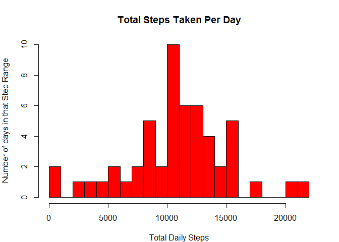

# Reproducible Research: Peer Assessment 1


## Loading and preprocessing the data
For this assignment we'll use the library ggplot2. 
Load the activity data from the working directory into a data frame.


```r
library(ggplot2)
file <- c("./activity.csv")
activity_data <- read.csv(file, header = T)
```

## What is mean total number of steps taken per day?
To determine the mean total number of steps taken per day, we'll calculate
the number of steps taken per day.  

First, ignore the missing values. For this step we'll ignore the missing values in the dataset by removing them.  Removing them ensures they won't be converted to zeros and effect the results erroneously. 

```r
activity_no_na <- na.omit(activity_data)
```
Second, aggregate the number of steps by date. There are 53 observations.  The number of days where data was captured over the reporting period of two months.


```r
activity_agg_daily_steps <- aggregate(activity_no_na$steps, by = list(Date=activity_no_na$date), sum, na.rm=TRUE)
```
### Plot a histogram of the toal number of steps taken each day.

```r
par(mar = c(4,4,4,2))
hist(activity_agg_daily_steps$x, breaks = 24,col = "red", main = "Total Steps Taken Per Day", xlab = "Total Daily Steps", ylab = "Number of days in that Step Range")
```

 

The mean total steps taken is:


```r
mean(activity_agg_daily_steps$x)
```

```
## [1] 10766.19
```

The median total steps taken is:


```r
median(activity_agg_daily_steps$x)
```

```
## [1] 10765
```

## What is the average daily activity pattern?

To answer this quesion we'll pre-process the data by putting the date field into a POSIXct format, and the interval field is defined as a factor. Then aggregate the data by totalling the steps for each interval and then taking the mean. This results in 288 observations representing each 5 minute interval.  


```r
activity_no_na$date <- as.POSIXct(activity_no_na$date, format = "%Y-%m-%d")
activity_no_na$interval <- as.factor(activity_no_na$interval)
activity_meansteps <- aggregate(x=list(steps=activity_no_na$steps), by = list(interval=activity_no_na$interval),FUN=mean, na.rm=T)
```

Using the field interval as a factor, establish levels in the aggregated data.  Then, to display properly in the plot, add a formatted time field to the data. 


```r
activity_meansteps$interval <- as.integer(levels(activity_meansteps$interval)[activity_meansteps$interval])
interval_timefrmt <- strptime(x=(sprintf("%04d", as.numeric(activity_meansteps$interval))), format="%H%M")
activity_meansteps_frmt <- cbind(activity_meansteps,interval_timefrmt)
```

Using the scales library, plot the average number of steps taken, averaged across all days.


```r
library(scales)
ggplot(activity_meansteps_frmt, aes(x=interval_timefrmt, y=steps)) +   
  geom_line(color="dark green", size=1) +  
  labs(title="Average Number of Steps Taken Daily", x="5 min Intervals charted from midnight (0)\nthrough midnight(2355)", y="Average Steps during the Interval") +
  scale_x_datetime(labels = date_format("%H:%M"))
```

 

Determine the 5-minute interval, on average across all the days in the dataset, that contains the maximum number of steps.


```r
activity_meansteps_frmt[which.max(activity_meansteps_frmt$steps),1]
```

```
## [1] 835
```

## Imputing missing values

Using the original dataset, calculate the number of missing values.


```r
sum(is.na(activity_data$steps))
```

```
## [1] 2304
```

Fill in the missing data.  For this dataset we're replacing each missing data (NA) with the mean for the 5 minute inteval over the entire data set.  We've already calculated that mean in the dataset: activity_meansteps.

The function **fill_missing_steps** will determine the correct value for each missing data.


```r
fill_missing_steps <- function(steps, int) {
  temp = 0
  if (!is.na(steps)) temp = steps
  else {
    temp = activity_meansteps[activity_meansteps$interval == int, "steps"]
    }
  return(temp)
}
```
Fill the missing data.

```r
activity_data_missingdata_filled <- activity_data
activity_data_missingdata_filled$steps <- mapply(fill_missing_steps,activity_data_missingdata_filled$steps,activity_data_missingdata_filled$interval)
```
Prepare the data for plotting a histogram of the imputed data.  Ensure the plot size is big enough by adjusting the margins. Aggregate the steps for each date. There are 61 observations. One for each day of the reporting period of two months.  This is 8 more days then the original histogram with missing data removed.

```r
par(mar = c(4,4,4,2))
activity_agg_daily_steps_imputed <- aggregate(activity_data_missingdata_filled$steps, by = list(Date=activity_data_missingdata_filled$date), sum, na.rm=TRUE)
```

###Plot the histogram showing the total number of steps taken each day.  

With the imputed data, more days were accounted for in the data and the average steps distributed differently across days. 

```r
hist(activity_agg_daily_steps_imputed$x, breaks = 24, col = "red", main = "Total Steps Taken Per Day", xlab = "Steps", ylab = "Number of days in that step range", ylim = c(0,20))
```

 

The mean number of steps taken per day:

```r
mean(activity_agg_daily_steps_imputed$x)
```

```
## [1] 10766.19
```
The median number of steps taken per day:

```r
median(activity_agg_daily_steps_imputed$x)
```

```
## [1] 10766.19
```

###What is the impact on imputing missing data on the estimates of the total daily number of steps?

In this example, the imputed data improved the understanding of the full dataset by showing data represented across the entire reporting period.  By including steps for each day, the full time was represented without impacting the aggresgated data.  It's important to understand **how** data was imputed so that when looking at non-aggregated values, imputed data can be handled in an appropriate way.  

## Are there differences in activity patterns between weekdays and weekends?

Prepare a data file where the weekday information will be stored.


```r
activity_data_grouped <- activity_data_missingdata_filled
```

The function **weekdayid** determines which day of the week the information is taken from and marks the data as either **Weekday** or **Weekend**.

```r
weekdayid <- function(date) {
  day <- weekdays(date)
  if (day %in% c("Monday", "Tuesday", "Wednesday", "Thursday", "Friday")) 
    return("Weekday") 
  else if (day %in% c("Saturday", "Sunday")) 
    return("Weekend")
  else stop("invalid date")
}
```

Pre-process the data by putting the date field into a POSIXct format, defining the interval field as a factor, and adding a new data field **day** to the data. Then, aggregate the steps for each interval + day, and take the average.


```r
activity_data_grouped$date <- as.POSIXct(activity_data_grouped$date, format = "%Y-%m-%d")
activity_data_grouped$interval <- as.factor(activity_data_grouped$interval)
activity_data_grouped$day <- sapply(activity_data_grouped$date, FUN = weekdayid)
daytype_mean <- aggregate(steps ~ interval + day, data = activity_data_grouped, mean)
```

Using the field interval as a factor, establish levels in the aggregated data.  Then, to display properly in the plot, add a formatted time field to the data. 


```r
daytype_mean$interval <- as.integer(levels(daytype_mean$interval)[daytype_mean$interval])
interval_timefrmt <- strptime(x=(sprintf("%04d", as.numeric(daytype_mean$interval))), format="%H%M")
daytype_mean_frmt <- cbind(daytype_mean,interval_timefrmt)
```

Using a planel plot, show the 5-minute intervals and the average number of steps taken for both Weekdays, and Weekends.


```r
ggplot(daytype_mean_frmt, aes(x=interval_timefrmt, y=steps)) +
  geom_line(col="dark green") + facet_grid(day ~ .) + 
  labs(title="Average Number of Steps Taken Daily", x="5 min Intervals charted from midnight (0)\nthrough midnight(2355)", y="Average Number of Steps Taken Daily") +
  scale_x_datetime(labels = date_format("%H:%M"))
```

 
